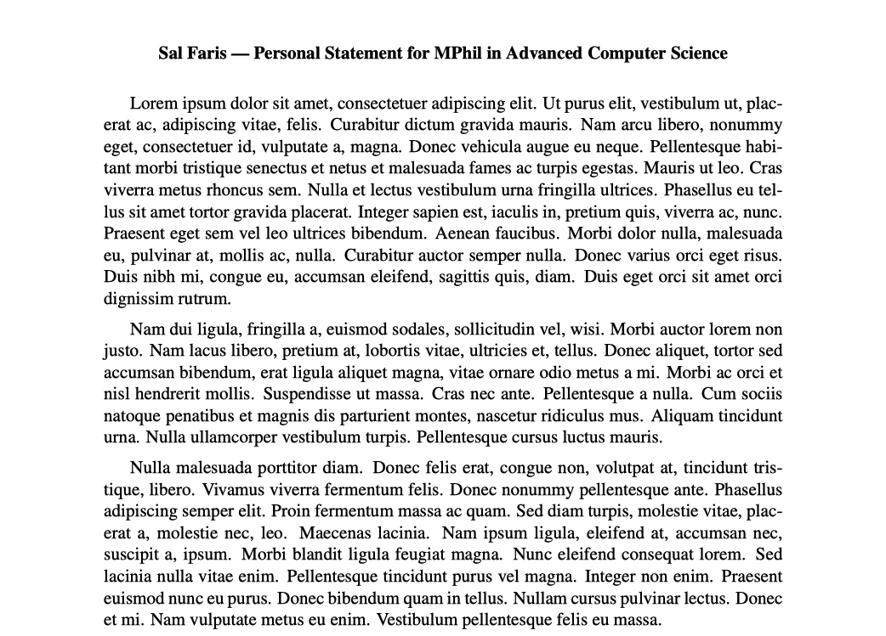

# :page_facing_up: EasyPS

**EasyPS** is a simple and easy-to-use personal statement LaTeX framework. This solves the problem of messy and duplicated tex files when writing personal statements for multiple universities.



### Table of contents
- [Download](#download)
- [Usage](#usage)
- [Why should I use this?](#why-should-i-use-this)
- [Warning for users :heavy_exclamation_mark: ](#heavy_exclamation_mark-warning-for-users)

## Download
There are two main methods to download the file, choose one only.

1. Download as a ZIP file by clicking the green **Code** button above.

2. If you have git installed, just clone the repository.
   ```zsh
   git clone https://github.com/salfaris/easy-ps
   ```

## Usage

 Only 4 steps: open, update settings, write content, compile.

1. Go to the `main` directory and open `main.tex` in your favorite LaTeX text editor (mine is Sublime Text).

2. Change these variables accordingly:
   ```tex
   studentName{insert-your-name}
   psForUniversity{insert-uni-you-are-applying-to}
   courseName{insert-your-course-name}
   showTitle{true/false}
   ```

    :heavy_exclamation_mark: There is one caveat for the `psForUniversity` variable; keep reading.

3. Open the `content` directory and create a new `.tex` file named **exactly equal (word-for-word)** to what you inserted in the `psForUniversity` variable. Then write your personal statement normally in this file.

    Note the file name **must** be the same word-for-word for otherwise, it will crash at compile time.

4. Build your PDF file as usual.

## Why should I use this?

Using this framework, you can easily add as many personal statements you want and activate/deactivate them by commenting out. For example, suppose this is my current settings in the preamble.

```tex
\studentName{Sal Faris}

% Uni of Cambridge
\psForUniversity{cambridge.tex}
\courseName{MPhil in Advanced Computer Science}
\showTitle{true}

%% Imperial College London
% \psForUniversity{imperial.tex}
% \courseName{MSc Computing}
% \showTitle{false}
```

If I make an edit to my PS content for Imperial and want to build again, it is as simple as comment/uncomment code.

```tex
\studentName{Sal Faris}

%% Uni of Cambridge
% \psForUniversity{cambridge.tex}
% \courseName{MPhil in Advanced Computer Science}
% \showTitle{true}

% Imperial College London
\psForUniversity{imperial.tex}
\courseName{MSc Computing}
\showTitle{false}
```

## Warning for users :heavy_exclamation_mark:
1. Directory and file names are sensitive, so changing the names of, for example, `content` and `easyps.cls` may cause a crash.
   
2. Do not edit anything after `\begin{document}`; unless you know what you are doing.
   
3. Again we emphasize, `psForUniversity` **must** match a `.tex` file in the `content` directory.


